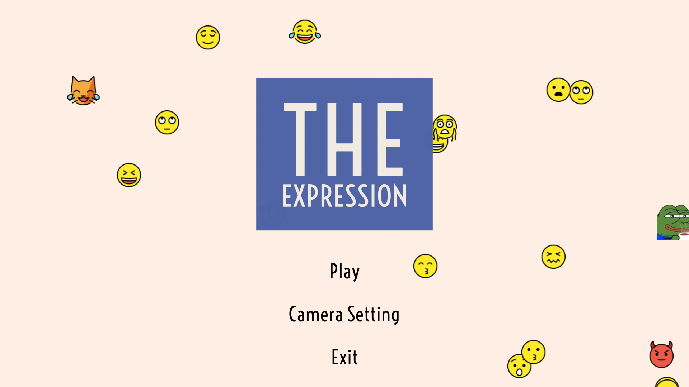

# The Expression - CMPT 419 Project
An Emotional Game for Social Expression Learning



## Requirements
- A webcam

## Dependencies
All the requirement dependencies are listed in requirements.txt

## Structure
Repository structure
- Dataset folder contains all the code to process the AFEW-VA dataset, from restructuring original AFEW-VA dataset to extracted facial expressions and packing them into a single h5 file. <br>
- Dataset/self-annotation images includes images that we annotated by ourselves, our annotations and also a mixed annotations (taking average of 2 self-annotations)
- the-expression.py is a driver to run the game. <br>
- Model/model.ipynb is a notebook to test and do experimential with the proposed models, only the VGG16-VA was integrated to the main game. <br>
- Game_Data/target_samples is the folder for customized target images, the images have to be processed using Dataset/game_target_generator.py before put in to this folder. (refering to Dataset/README.md for more details) <br>
- Dataset/utils/haarcascade_frontalface_alt2.xml is haar cascade face detector of opencv, can be downloaded [here](https://github.com/opencv/opencv/tree/master/data/haarcascades).
- Dataset/utils/shape_predictor_68_face_landmarks.dat is facial landmarks detector of dlib, can be downloaded [here](https://github.com/davisking/dlib-models).

The original AFEW-VA dataset can be found [here](https://ibug.doc.ic.ac.uk/resources/afew-va-database/). <br>

The processed AFEW-VA dataset can be found [here](https://tinyurl.com/AFEW-VA-processed), the link included: <br>
- A trained model of VGG16 transfer learning structure "trained_VGG16-VA.h5"
- An image dataset packed into h5 "facial_data.h5" (the README.md in the dataset folder has more details to unpack this file)
- The true labels from AFEW-VA "label_data.csv"

## How to Use
- Install dependencies
```bash
pip install -r requirements.txt
```
- To play
```bash
python the-expression.py
```

## Supported OS
Python version 3.7.8 on

- Windows 10 <br>
- Linux <br>
- MAC OS (Not tested) <br>

## Self-Evaluation
Overall, we think we have developed and fullfilled all the objectives that we proposed.
- About Game <br>
[:heavy_check_mark:] Camera Integration <br>
[:heavy_check_mark:] Game UI <br>
[:heavy_check_mark:] Music <br>
[:heavy_check_mark:] Animation <br>
- Machine Learning Model  <br>
[:heavy_check_mark:] Functional Model <br>
[:heavy_check_mark:] Cross-validation <br>
- Dataset <br>
[:heavy_check_mark:] Processing <br>
[:heavy_check_mark:] 20 Self-annotation Images <br>
[:heavy_check_mark:] Inter-rater Score <br>
- Features not in our plan but we did <br>
[:heavy_check_mark:] User can add their customized target images <br>
[:heavy_check_mark:] Real-time face detection <br>

However, there are some changes that we have to make, specifically, in the beginning, we thought that our integrated facial landmark model could achieve a good score to be our main model but as a result, the facial landmark integrated model does not satisfy our goal, the predictions are too poor and because of the biased dataset, we have to change to transfer learning to improve the outcomes. We only intended to experiment with 3 models but because of poor accuracy, we end up experimenting 5 models in total. Our VGG16-VA prediction is also not perfect, we think that if we are able to get the model training on AffectNet, it will be better but the AffectNet is very hard to get and there aren't many dataset with Arousal-Valence labels.

## Citing
All the assets and musics in the game are not ours.

* Paimon - discord emoji. Emoji.gg - Discord, Slack &amp; Guilded emojis. (n.d.). Retrieved April 15, 2022, from https://emoji.gg/pack/9403-paimon 
* Free logo maker: Design custom logos | Adobe Express. (n.d.). Retrieved April 15, 2022, from https://www.adobe.com/express/create/logo 
* OpenMoji. (n.d.). Retrieved April 15, 2022, from https://openmoji.org/ 
* Twitch Frog Emotes. (n.d.).
* Face ID icon - face ID icon SVG Png image: Transparent png free download on seekpng. SeekPNG.com. (n.d.). Retrieved April 15, 2022, from https://www.seekpng.com/ipng/u2e6a9t4o0q8t4y3_face-id-icon-face-id-icon-svg/ 
* Royalty free music by BENSOUND. Bensound. (n.d.). Retrieved April 15, 2022, from https://www.bensound.com/ 
* Awesome Free assets for your next video project. Mixkit. (n.d.). Retrieved April 15, 2022, from https://mixkit.co/ 
* Free stock music: Download free music for videos. FiftySounds. (n.d.). Retrieved April 15, 2022, from https://www.fiftysounds.com/ 

* J. Kossaifi, G. Tzimiropoulos, S. Todorovic and M. Pantic, "AFEW-VA database for valence and arousal estimation in-the-wild", in Image and Vision Computing, 2017. 

* A. Dhall, R. Goecke, S. Lucey and T. Gedeon, "Collecting Large, Richly Annotated Facial-Expression Databases from Movies," in IEEE MultiMedia, vol. 19, no. 3, pp. 34-41, July-Sept. 2012.
